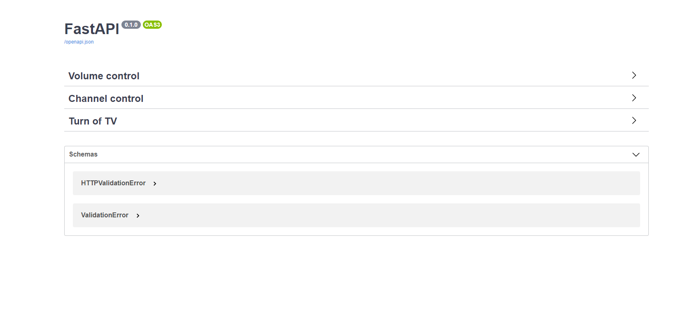
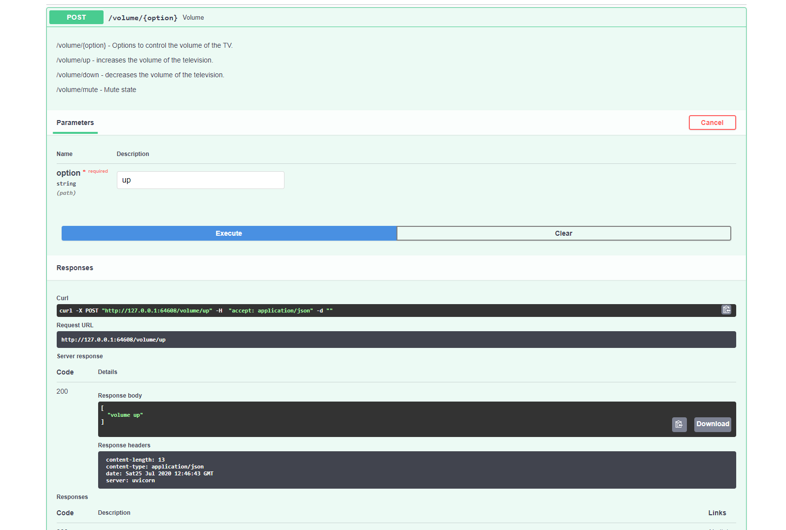
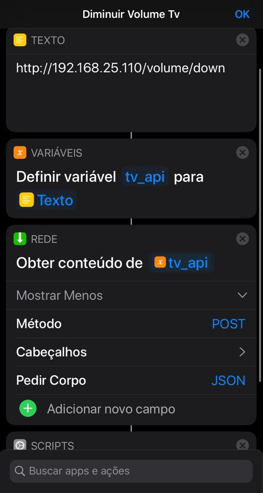

Samsung tv control API
----------------------

Using the `samsuntctl` and` fast api` module, I created a RESTFull api for simple Samsung TV`s controls.

Installation:
------------

* Enter the tv ip and mac address in the Dockerfile or use config.json

How to usage:
------------

```bash
docker-compose -f "docker-compose.yml" up -d --build
```

Acess:

*  http://localhost/docs

Samples:
--------

1- Swagger by fastapi


1- Volume example



IOS Shortcut
------------

To integrate the API with Siri, I created a shortcut that sends a post method to the API with the command.

[Shortcut sample](https://www.icloud.com/shortcuts/485481e2b74a4b6b9c0a18e8a3f1329f)

* `Edit the shortcut and enter your api's ip.`




